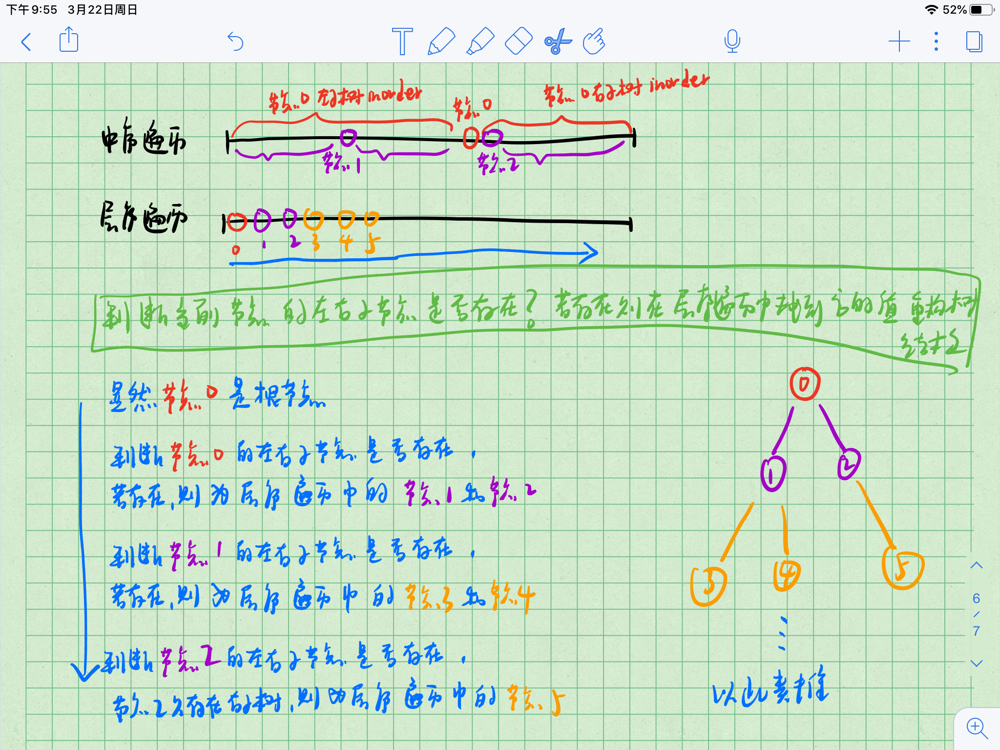

[1259. 二叉树遍历](https://www.acwing.com/problem/content/1261/)

#### 算法：

遍历层序遍历序列，通过中序遍历序列判断当前节点是否有左右子节点，若有则重构出来。

具体步骤如下：

1. 通用队列维护重构出来的树结构，首先层序遍历的第一个数为根结点的值，重构根结点并放入队列中；

2. 使用两个指针 i，j 分别指向层次遍历序列中当前层和下一层的起点，然后遍历当前层的节点；

3. 通过判断当前层中的节点在 inorder 中该位置左右是否有未使用的字符来判断左右子节点是否存在；

4. 弹出队列中的当前节点，若存在则重构出存在的子节点并建立指针连接，后放入队列中，继续遍历。



#### 复杂度分析：

使用哈希表（hashmap）记录每个值在中序遍历中的位置，使在中序遍历中查找节点位置的操作只需要 O(1) 的时间。此时，创建每个节点需要的时间是 O(1)，所以总时间复杂度是 O(n)。

#### 代码：

```java
import java.util.*;

public class Main {
    
    private static String dfs(Node root) {
        if (root == null) return "";
        String ret = root.val + "";
        ret += dfs(root.left);
        ret += dfs(root.right);
        return ret;
    }
    
    public static void main(String[] args) {
        Scanner sc = new Scanner(System.in);
        char[] inorder = sc.nextLine().toCharArray();
        char[] lorder = sc.nextLine().toCharArray();
        HashMap<Character, Integer> positions = new HashMap<>();
        for (int i = 0; i < inorder.length; i++) positions.put(inorder[i], i);
        // 标记 inorder 中已经使用过的字符
        boolean[] visited = new boolean[26];
        
        Queue<Node> queue = new ArrayDeque<>();
        Node root = new Node(lorder[0]);
        queue.offer(root);
        // 按层遍历，i 是当前层的起点，j 是下一层的起点
        int i = 0, j = 1;
        while (j < lorder.length) {
            // 遍历当前层（当前层的结尾小于下一层的起点）
            int end = j;
            while (i < end) {
                Node cur = queue.poll();
                // 当前节点在 inorder 中的位置
                // 通过判断 inorder 中该位置左右是否有未使用的字符来判断左右子节点是否存在
                int p = positions.get(lorder[i++]);
                visited[p] = true;
                // 判断左儿子是否存在，存在则重构
                if (p > 0 && !visited[p - 1]) {
                    cur.left = new Node(lorder[j++]);
                    queue.offer(cur.left);
                }
                // 判断右儿子是否存在，存在则重构
                if (p < lorder.length - 1 && !visited[p + 1]) {
                    cur.right = new Node(lorder[j++]);
                    queue.offer(cur.right);
                }
            }
        }
        
        System.out.println(dfs(root));
    }
}

class Node {
    char val;
    Node left, right;
    
    public Node(char val) {
        this.val = val;
    }
}
```

